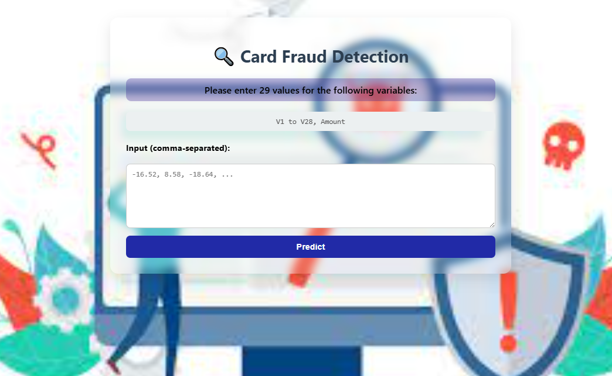
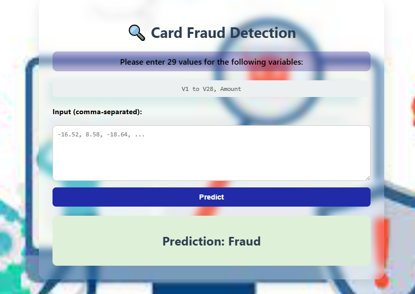

# **Card Fraud Detection System** 🕵️‍♂️💳

<div style="display: flex; justify-content: space-between;">
  
<!--      -->
  
</div>

## **🔍 Overview**

This project presents a **robust, end-to-end machine learning pipeline** for detecting fraudulent transactions using classification models such as **Logistic Regression**, **Random Forest**, **Decision Tree**, and **XGBoost**.

It follows modern MLOps practices by integrating:

- ⚙️ **Modular pipeline structure** for data processing, training, and evaluation
- 🗂️ **YAML-based configuration management** to keep the code clean and reusable
- 📦 **DVC (Data Version Control)** for tracking datasets, models, and pipeline stages
- 🚀 **CI/CD automation via GitHub Actions** to run tests, train models, and manage artifacts on every code push

### Key components include:

- **SMOTE** for class imbalance correction
- **Multiple classifiers** (XGBoost, RandomForest, etc.)
- **Modular configuration via YAML**
- **Data versioning with DVC**
- **CI/CD readiness** for automated ML workflows

---

## 🗃️ Dataset Overview

🔗 **Dataset Source**: [Credit Card Fraud Detection Dataset on Kaggle](https://www.kaggle.com/datasets/mlg-ulb/creditcardfraud)

This dataset contains credit card transactions made by European cardholders in **September 2013** over a period of **two days**. It includes a total of **284,807 transactions**, among which only **492 are fraudulent**—making the dataset **highly imbalanced** with the positive (fraud) class accounting for just **0.172%**.

### 📊 Key Characteristics:

- All features are **numerical** and anonymized using **PCA (Principal Component Analysis)**, except:
  - `Time`: Seconds elapsed between the transaction and the first transaction in the dataset.
  - `Amount`: Transaction amount.
  - `Class`: Target variable (`1` for fraud, `0` for non-fraud).
- Due to confidentiality, the original feature names and business context are withheld.
- Given the extreme imbalance, **accuracy is not a reliable metric**. Alternative metrics such as **AUPRC (Area Under Precision-Recall Curve)** are more appropriate for evaluation.

### 🔁 Handling Class Imbalance:

To address this challenge, **SMOTE (Synthetic Minority Over-sampling Technique)** was applied **only to the training set** after splitting:

- **Original Training Data Shape**: `227,845 x 31`
- **After Oversampling with SMOTE**: `442,012 x 30`

> For more background, refer to the EDA notebook and related publications.

> ## 📈 Exploratory Data Analysis (EDA)

Check out the detailed EDA in the notebook below:

🔗 [EDA Research Notebook](research/EDA.ipynb)

📚 **Acknowledgements**:
This dataset was provided by [ULB’s Machine Learning Group (MLG)](http://mlg.ulb.ac.be) and Worldline.  
It has been widely used in fraud detection research. For methodology references, see the [Fraud Detection Handbook](https://fraud-detection-handbook.github.io/fraud-detection-handbook/Chapter_3_GettingStarted/SimulatedDataset.html).

## **📁 Project Structure**

```bash
CardFraud/
│
├── .github/workflows/.gitkeep         # CI workflow placeholder
├── config/
│   └── config.yaml                    # YAML config for paths/artifacts
├── params.yaml                        # Hyperparameters & model settings
├── requirements.txt                   # Python dependencies
├── setup.py                           # Project setup file
├── research/
│   └── trials.ipynb                   # Jupyter notebook for EDA & experiments
└── src/CardFraud/
    ├── __init__.py
    ├── component/
    │   ├── __init__.py
    │   ├── data_ingestion.py         # Ingests and splits data
    │   ├── data_preprocessing.py     # Cleans, balances, scales data
    │   └── data_training.py          # Trains and evaluates models
    ├── config/
    │   └── __init__.py
    ├── constant/
    │   └── __init__.py
    ├── entity/
    │   ├── __init__.py
    │   └── con.py                    # Data classes (configs, entities)
    ├── pipeline/
    │   ├── __init__.py
    │   └── main.py                   # Orchestrates pipeline steps
    └── utils/
        └── __init__.py
```

## 📄 YAML Configuration Management

We use **YAML** files to decouple code logic from configuration:

- `config.yaml`: Contains path settings, directory names, and artifact locations
- `params.yaml`: Defines hyperparameters for models, test split ratios, and SMOTE settings

### 🔧 Why YAML?

- Easy to edit and tune
- Promotes modularity and reusability
- Keeps experiment setup clean and reproducible

---

## 📦 DVC for Data & Pipeline Versioning

We integrate **DVC (Data Version Control)** to manage:

- Raw and processed datasets
- Tracked versions of training outputs
- Complete ML pipeline with reproducibility

### ✅ DVC Benefits

- Git-like control for large files and models
- Pipeline automation via `dvc.yaml`
- Easy rollback and sharing of datasets/models

### 🔧 Basic DVC Usage

```bash
dvc init
dvc add data/raw.csv
dvc run -n preprocess -d src/... -o data/processed/ ...
dvc repro  # Re-runs updated stages
⚙️ CI/CD Pipeline Ready
This project is CI/CD-ready using GitHub Actions or similar tools:

Triggers pipeline on every push/merge

Installs dependencies

Runs linting/tests/training pipeline

Saves model artifacts

📁 Add .github/workflows/train.yml
yaml
Copy
Edit
name: Model Training

on: [push]

jobs:
  train:
    runs-on: ubuntu-latest
    steps:
      - uses: actions/checkout@v2

      - name: Set up Python
        uses: actions/setup-python@v2
        with:
          python-version: '3.10'

      - name: Install dependencies
        run: pip install -r requirements.txt

      - name: Run pipeline
        run: python src/CardFraud/pipeline/main.py
```

## 📊 Model Results Summary

| Model              | Accuracy | Precision | Recall | F1 Score |
| ------------------ | -------- | --------- | ------ | -------- |
| LogisticRegression | 0.9803   | 0.0742    | 0.9072 | 0.1371   |
| RandomForest       | 0.9995   | 0.8804    | 0.8350 | 0.8571   |
| DecisionTree       | 0.9975   | 0.3878    | 0.7835 | 0.5187   |
| XGBoost            | 0.9995   | 0.8586    | 0.8763 | 0.8673   |

🏆 **Best Model**: **XGBoost** with an **F1 Score** of **0.8673**

🚀 How to Run
Clone the repository

Install dependencies

bash
Copy
Edit
pip install -r requirements.txt
Edit config.yaml and params.yaml as needed

Run the pipeline

bash
Copy
Edit
python src/CardFraud/pipeline/main.py

**✍️ Author**
Developed by **Mazen Asag**
Feel free to open issues or submit PRs!

```

```
